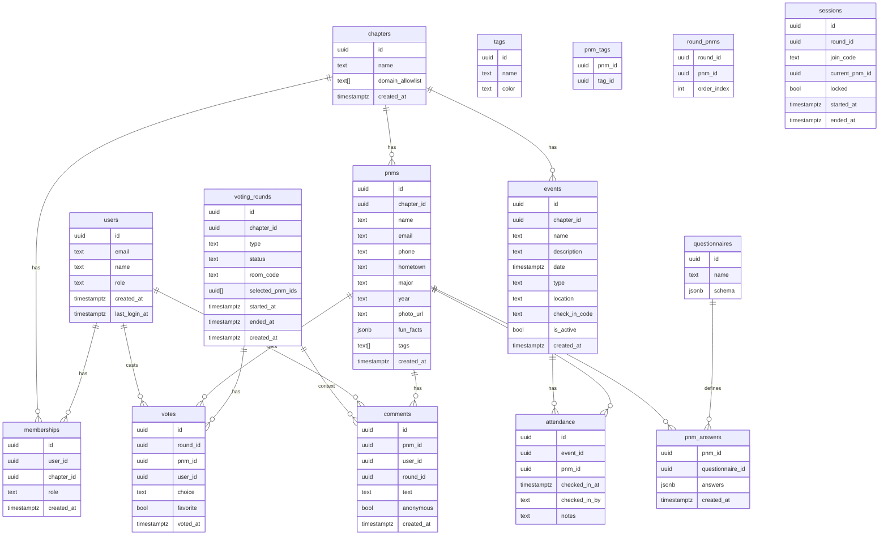
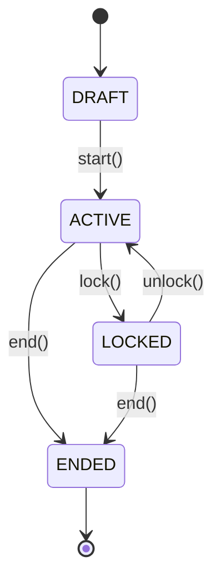
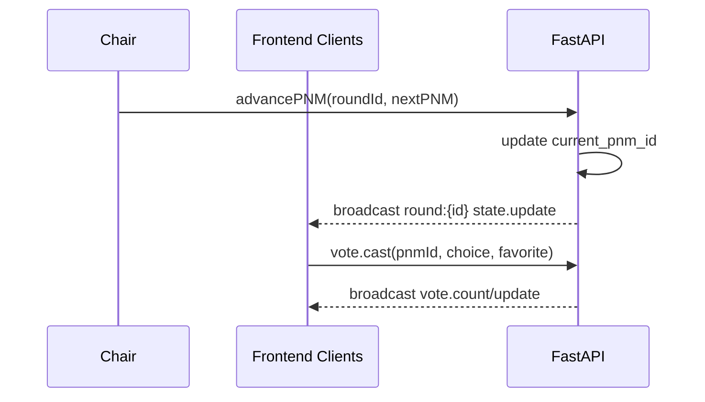

## RushRank PRD v1

### MVP Scope (1‑page overview)
- PNM intake (mobile web): name, phone, email, hometown, major, year, photo upload, timestamp; optional geotag.
- Admin-configurable questionnaires: simple field types; required/optional; surfaced on PNM profile and exports.
- Tagging: admin‑defined tag set; colored pills; bulk apply; filters.
- Notes/comments: anonymous toggle; timestamps; admin moderation/delete.
- Voting: Yes/No/Don’t Know with Favorite star; swipe or buttons (session‑level toggle).
- Session management: start/stop, advance current PNM, timer option, lock/unlock, “collected all votes” indicator.
- Anonymous vs transparent voting: session‑level; exports respect mode.
- Ranked results: sort by total Yes; bubble Favorites; “controversial” heuristic (vote stddev).
- Search/filter: name, major, hometown, tags, favorites, attendance, vote ratio.
- Events and attendance: create events; check‑in by search or QR; attendance history per PNM.
- Exports: CSV; shareable PNM graphic server‑side.
- Auth: Supabase email/password with allowlist; Rush Chair (admin) vs Brother (voter) permissions.
- Realtime: round state and votes sync with <300ms target.
- Mobile‑first PWA; deploy FE to Vercel, BE to Railway/Render/Fly.io; Postgres (Supabase).

---

### 1) Executive Summary
RushRank is a mobile‑first web app that digitizes fraternity rush: capturing PNMs in the field, coordinating fast, unbiased voting, and producing ranked results for bid decisions. It targets Rush Chairs/Admins (or officers) who manage sessions and exports, Brothers who vote on PNMs quickly and consistently, and PNMs only for self‑intake. The product removes paper lists, ad‑hoc spreadsheets, and chaotic group chats, replacing them with a reliable, auditable workflow.

### 2) Problem Statement & Goals
Problems today:
- Intake is slow, error‑prone, and inconsistent; PNM photos are lost or mislinked.
- Voting is fragmented across group chats/notes; hard to synchronize a live room.
- Results require manual consolidation; difficult to analyze favorites or disagreements.
- Attendance tracking isn’t tied to outcomes.

Goals (measurable):
- Reduce PNM intake time by 50% (median ≤ 60 seconds from form open to save).
- Ensure live round state sync latency < 300 ms P95 across voters.
- Produce ranked results instantly (< 1s query time for 500 PNMs).
- Increase photo attachment rate to > 95% of PNMs captured.
- Achieve 0 “lost votes” per round via session lock and collected indicators.

### 3) Personas & Primary Use Cases
Rush Chair (Admin)
- Start/stop rounds; advance PNMs; lock/unlock voting.
- Configure swipe vs button voting; anonymous vs transparent.
- Create/manage events; export CSV; print/share PNM graphics.
Success: Smooth sessions; complete data; fast exports; confidence in rankings.

Brother (Voter)
- Join session; vote quickly via swipe/buttons; mark favorites; leave short notes.
Success: Simple, snappy UI; clear state; no confusion about current PNM.

PNM (Self‑logging only)
- Fill intake form on mobile; allow photo; optional fun facts/questions.
Success: 1‑minute completion; responsive form; confirmation feedback.

### 4) In‑Scope vs Out‑of‑Scope
In‑Scope (MVP + Phase 2)
- All features listed in sections 5 and 6.
- Supabase Auth allowlist; FastAPI backend; Postgres; Supabase Storage for photos.
- PWA behavior; offline rudiments for intake in Phase 2.

Out‑of‑Scope
- Payments, DM/chat, alumni portal, cross‑chapter federation, AI‑generated decisions (beyond optional tag suggestions), complex CRM integrations.

### 5) Detailed Feature Requirements (MVP)
User stories, acceptance criteria (AC), edge cases (EC).

PNM Self‑Logging
- As a PNM, I can submit name, phone, email, hometown, major, year; add photo; timestamp captured; optional geotag.
- AC:
  - [ ] Required fields validated with inline errors; phone/email formats checked.
  - [ ] Photo upload succeeds to storage; preview shown.
  - [ ] Submit returns success and shows confirmation.
  - [ ] Data appears for admin within 1s.
  - [ ] Optional geotag saved when permitted.
- EC: flaky network; duplicate email/phone; oversized images (compress client‑side); permission‑denied geotag.

Custom Questionnaires
- As Admin, I can define extra fields (text, select, boolean, number) and which are required.
- AC:
  - [ ] Schema stored; fields rendered on intake form and PNM profile.
  - [ ] Required enforced; types validated.
  - [ ] Included in exports and shareable graphic summary (selected fields).
- EC: schema updates mid‑rush; versioning strategy records which PNMs used which schema.

PNM Tagging
- As Admin, I create a tag set (e.g., Athlete, Legacy) with colors, bulk apply, and filter PNMs by tag.
- AC:
  - [ ] Tags are colored pills on PNM list/profile.
  - [ ] Bulk apply to filtered list.
  - [ ] Filter/search combines with name/major/hometown.
- EC: tag rename/merge; large tag sets (≥100).

Notes + Comments
- As Brother, I can leave a short note per PNM; optionally anonymous; Admin can delete.
- AC:
  - [ ] Notes timestamped; author stored unless anonymous.
  - [ ] Admin delete removes immediately for all.
  - [ ] Abuse reporting via long‑press/menu.
- EC: profanity; spam; anonymous abuse moderated.

Voting (Swipe or Buttons)
- As Brother, I vote Yes/No/Don’t Know, mark Favorite; swipe UI or buttons set by Admin per session.
- AC:
  - [ ] Only one active PNM; vote recorded idempotently; Favorite toggle persists.
  - [ ] Keyboard support for buttons; settings reflect session choice.
  - [ ] Collected indicator shows after all present voters cast.
- EC: user double‑submits; device rotation; offline transient—queue then sync when online.

Voting Session Management
- As Chair, I start/stop a round, advance PNM, set timer, lock/unlock; see collected‑all indicator.
- AC:
  - [ ] Start sets ACTIVE; end sets COMPLETED; locked prevents new votes.
  - [ ] Auto‑advance timer available; manual override always works.
  - [ ] Current PNM broadcast to all clients in < 300 ms P95.
- EC: chair disconnects; multiple chairs (resolve via role policy and ownership).

Anonymous vs Transparent Voting
- As Chair, I choose anonymity per session; exports reflect mode.
- AC:
  - [ ] Anonymous mode hides voter identities in results/export; transparent shows.
  - [ ] Mode indicated in UI and audit logs.
- EC: mid‑round change prompts confirmation and audit entry; applied prospectively only.

Ranked Results
- Sort by Yes percentage then vote count; bubble Favorites; mark “controversial” via stddev threshold (e.g., ≥2.0).
- AC:
  - [ ] Results query < 1s for 500 PNMs.
  - [ ] Controversial flag visible; sortable columns.
  - [ ] Export respects chosen sort.
- EC: ties; few votes produce low confidence—display badge.

Search + Filter
- Search PNMs by name, major, hometown, tags, favorites, attendance, vote ratio.
- AC:
  - [ ] Filters are combinable; back/forward maintains state via URL params.
  - [ ] Full‑text index supports prefix queries; results < 300 ms for 5k PNMs.
- EC: diacritics; multi‑field tokenization.

Event Management & Attendance Tracking
- As Admin, create events; check‑in PNMs by search or QR; see per‑PNM history.
- AC:
  - [ ] Unique attendance per event/pnm; duplicate prevented.
  - [ ] Active events show first; QR join optional.
  - [ ] Attendance stats on PNM profile and filters.
- EC: check‑in code leakage (rotate codes).

Exports
- CSV: all PNM data, attendance rollups, aggregated votes; selectable columns.
- Shareable PNM Graphic: server‑rendered image with photo, name, major, hometown, selected fun facts, and optional vote summary depending on privacy mode.
- AC:
  - [ ] Export completes < 5s for 5k PNMs.
  - [ ] Images saved with consistent typography; safe margins; fallback if photo missing.
- EC: large images; long names—truncate gracefully.

### 6) Feature Requirements (Phase 2)
- Group comparison (3–5 PNMs side‑by‑side).
- Weighted votes (exec), tie‑breakers.
- Analytics dashboard: vote ratios, attendance funnels.
- Offline‑first intake with later sync (queue + conflict resolution).
- Gamification, AI‑suggested tags (optional).

### 7) UX & Component Mapping
21st.dev components to use (and current repo reality):
- Global shell: Aceternity Sidebar + Spectrum Profile Dropdown.
- Auth pages: Aceternity Signup Form.
- PNM index/admin: Ruixen Table.
- Voting: HyggeMethat Tinder-like Swipe.
- Landing/transitions: Ali Imam Shader Animation.

Repository references:
- Route system uses Wouter with Vite React (not Next.js). Pages in `client/src/pages/*`.
- Shader Animation demo added at `/demo/shader`.
- Planned demo routes present in `App.tsx` for Tinder Swipe and Ruixen Table.

Navigation model:
- Admin sees Dashboard (rounds), PNMs index, Events, Results, Settings.
- Brother sees Voting, PNMs, limited Results if allowed.

Mobile‑first:
- Primary layouts stack; controls in thumb‑reach; swipe gestures; safe areas respected.
- Breakpoints: xs (≤ 360), sm (≤ 640), md (≤ 768), lg (≤ 1024), xl (desktop).
- Motion‑reduction: prefer opacity/scale; gate parallax behind reduced‑motion.

Accessibility:
- Keyboard navigation for buttons voting; ARIA roles; focus visible.
- Reduced motion honors `prefers-reduced-motion`.

### 8) Information Architecture & Data Model (High‑Level)
Note: Aligning with current FastAPI and `shared/schema.ts`. Some deltas remain vs idealized schema below.

ERD


Indexes & constraints
- Unique: `votes(user_id, round_id, pnm_id)`. Unique attendance per event/pnm. Optional `round_pnms` composite key.
- FKs with ON DELETE: cascade on membership deletions to clean derived rows where appropriate; avoid cascading user deletion into votes (anonymize instead).
- Full‑text index on PNMs (name, major, hometown); trigram for fast search.

### 9) API Contract (Initial)
Aligns to FastAPI routes in repo (`python_server/routes.py`), with additions for questionnaires, tags, comments, exports.

Auth
- POST /api/auth/signup, POST /api/auth/login (Supabase client; server validates allowlist).
- GET /api/me → 200 UserProfile. Requires auth.

Chapters
- GET /api/chapters → 200 [Chapter]. Auth, membership.
- POST /api/chapters → 200 Chapter. Auth, admin.

PNMs
- GET /api/pnms?chapter_id= → 200 [PNM]. Auth + membership.
- POST /api/pnms?chapter_id= → 200 PNM. Auth + admin.
- GET /api/pnms/:id → 200 PNM. Auth + membership.
- PUT /api/pnms/:id → 200 PNM. Auth + admin (by chapter).
- DELETE /api/pnms/:id → 200 APIResponse. Auth + admin.
- FUTURE: GET /api/pnms?search=&tag=&favorite=... with pagination.

Rounds & Votes
- GET /api/rounds?chapter_id= → 200 [VotingRound]. Auth + membership.
- GET /api/rounds/active?chapter_id= → 200 VotingRoundWithDetails|null.
- POST /api/rounds?chapter_id= body RoundCreate → 200 VotingRound. Auth + admin; ends existing active and starts new ACTIVE round.
- PUT /api/rounds/:id/end → 200 APIResponse. Auth + admin.
- POST /api/rounds/:id/votes body VoteCreate → 200 Vote. Auth + membership; upsert vote.
- GET /api/rounds/:id/results → 200 [PNMWithVotes]. Auth + membership.

Events & Attendance
- GET /api/events?chapter_id= → 200 [Event]. Auth + membership.
- POST /api/events?chapter_id= body EventCreate → 200 Event. Auth + admin.
- POST /api/events/:event_id/attendance body AttendanceCreate → 200 Attendance. Auth + membership.

Questionnaires (new)
- POST /api/questionnaires → 200 Questionnaire. Admin only.
- GET /api/questionnaires → 200 [Questionnaire].
- POST /api/pnms/:id/answers → 200 PNMAnswers.

Tags (new)
- POST /api/tags → 200 Tag. Admin only.
- GET /api/tags → 200 [Tag].
- POST /api/pnms/:id/tags → 200 PNM. Admin/brother per policy.
- DELETE /api/pnms/:id/tags/:tagId → 200 APIResponse.

Comments (new)
- POST /api/pnms/:id/comments → 200 Comment (anon toggle).
- DELETE /api/comments/:id → 200 APIResponse (admin).

Exports
- GET /api/export/csv?chapter_id=&filters= → CSV file.
- GET /api/pnms/:id/share-card → image/png.

Realtime
- Channel naming: `round:{roundId}`, events: `state.update`, `pnm.advance`, `vote.cast`, `lock.toggle`, `timer.tick`.
- Payload includes ETag/version to avoid write conflicts.

Patterns
- Pagination: `?page=` `?limit=`. Sorting via `?sort=field:asc`.
- Errors: standardized JSON `{ error, detail }`.

### 10) Authentication & Authorization
Supabase Auth email/password with allowlist (chapter domains or emails).
- New signup checked against allowlist; otherwise rejected.
- Roles:
  - Rush Chair (admin): create chapters, rounds, events, tags, questionnaires, delete comments, exports.
  - Brother (member): vote, comment (anon or attributed), view limited results.
  - Observer (optional): view‑only where permitted.
Session vs user auth
- Must be authenticated AND a chapter member to vote; joining a session uses `room_code` to scope the round, but still requires auth.

### 11) Security, Privacy & Compliance
- PII: name, email, phone; secure at rest (Postgres, storage), TLS in transit.
- Password policy per Supabase defaults; session expiration per JWT TTL; store tokens securely (httpOnly if proxied; otherwise memory).
- Rate limits: intake and vote endpoints; lock down exports.
- Audit logs: admin actions (round start/end, lock, deletions).
- Content moderation: admin delete of comments; report mechanism.

### 12) Non‑Functional Requirements
- Performance: FE TTFB < 200 ms on Vercel; LCP < 2.5s on mid‑tier phones; API p95 < 300 ms; realtime < 300 ms p95.
- Reliability: 99.9% during rush week windows; graceful degradation offline for intake (Phase 2).
- Observability: structured logs, request IDs; error tracking (Sentry); metrics (Prometheus or provider).
- Accessibility: keyboard voting; color contrast; reduced motion fallback.

### 13) Exports & Shareable Graphics
CSV
- Columns: PNM core fields, tags, attendance counts, vote aggregates (yes/no/unknown, favorites, yes%), controversial score, questionnaire fields (flattened).
- Filters: tag, attendance, result thresholds.

Graphic generation
- Server‑side with Python (Pillow/cairosvg/playwright). Template with typography, rounded photo, name, major, hometown, selected fun facts. If anonymous mode, omit per‑user data; may include vote summary aggregate if policy allows.
- Filenames: `pnm-{id}-{slugified-name}.png`. Stored under `share-cards/{chapter_id}/`.

### 14) Analytics & Metrics
- Adoption: # of active chapters, active voters per round.
- Engagement: median time to complete vote set; votes per voter; percentage favorites used.
- Data quality: intake completion rates; photo attach rate.
- Reliability: message delivery success rate; round sync latency; error rates.

### 15) Release Plan & Milestones
Sprint 1 (MVP core)
- Intake form, photo upload, PNM list, tags, notes.
- Rounds start/stop, current PNM advance, button voting, favorites.
- Results basic rank; CSV export v1.

Sprint 2 (MVP+)
- Swipe voting mode; anonymous vs transparent; events + attendance; shareable PNM graphic; filters/search; collected indicator; timer.

Pilot
- One chapter pilot for rush week; daily backups; on‑call support window.

Cutlines & contingency
- If transparent voting UI not ready, ship anonymous only.
- If swipe performance is shaky on low‑end devices, default to buttons with optional swipe.

### 16) Risks & Mitigations
- Network reliability during live sessions → local queue + optimistic UI; clear offline banners.
- Photo capture compatibility → test across iOS/Android browsers; compress < 2MB client‑side.
- Privacy optics of transparent mode → default to anonymous; require explicit admin confirmation.
- Load spikes → provision read replicas/caching for results; CDN for assets.

### 17) Open Questions & Assumptions
- Exact fun‑facts schema and which appear on share card.
- Allow list mechanism: domain vs email list per chapter; UI to manage.
- Who can bulk tag—admins only or members?
- Final policy for exposing “controversial” label to voters vs admins only.
- Migration path to Next.js: timing and minimal parity checklist (see Appendix).

### 18) Appendices

High‑Level Architecture
```mermaid
flowchart LR
  A[Next.js PWA (planned) / Vite React (current)] -- HTTPS --> B[FastAPI]
  B -- SQL/REST --> C[Postgres (Supabase)]
  A -- Supabase JS --> C
  A -- Storage SDK --> D[Supabase Storage]
  B -- Realtime WS / Broadcast --> A
  B -- Export / Graphics --> E[Image Generator]
```

Voting Session State Machine


Realtime Event Flow


Technical Foundations (Repository Awareness)
- Current repo uses Vite + React + Wouter with Tailwind + shadcn/ui configured.
  - Components path: `client/src/components/ui`.
  - Styles: `client/src/index.css`.
  - Shader demo available at `/demo/shader`.
- Backend present: FastAPI (`python_server/`) with routes for chapters, PNMs, rounds, votes, events, attendance; Postgres via `asyncpg`.
- Supabase: documented; storage and auth intended (see `SUPABASE_CONFIG.md`).

Next.js Migration Path (App Router)
1) Create Next.js app with TS and Tailwind:
   - `npx create-next-app@latest rushrank-web --ts --use-pnpm --eslint`
   - `cd rushrank-web && npx tailwindcss init -p`
   - Configure `tailwind.config.ts` content for `app/**/*.{ts,tsx}`, `components/**/*.{ts,tsx}`.
2) Install shadcn/ui and set aliases:
   - `npx shadcn@latest init` (or `shadcn-ui@latest`), set `components` to `@/components`, `ui` to `@/components/ui`, CSS to `app/globals.css`.
3) Port components from `client/src/components/ui` into `apps` `components/ui`.
4) Replace Wouter routing with Next App Router pages; port existing pages under `app/` routes.
5) Configure Supabase client in Next (server actions where applicable).
6) PWA: add `next-pwa`; icons/manifest; service worker for offline intake (Phase 2).

MVP Test Plan (10 manual cases)
1) PNM intake happy path: fill required, attach photo, submit; expected: success toast, PNM visible in admin.
2) Intake validation: invalid email/phone; expected: inline errors; submit disabled until fixed.
3) Create round (admin): select 10 PNMs; expected: prior active rounds ended; new ACTIVE with room code.
4) Voting buttons: cast Yes, toggle Favorite; expected: upsert persisted; page refresh shows same.
5) Swipe voting: enable swipe mode; perform left/right/up; expected: mapped choices and favorite.
6) Lock/unlock: while locked, voting disabled; unlock re‑enables; latency < 300 ms.
7) Advance PNM: next PNM shows for all clients; collected indicator clears; timer restarts if enabled.
8) Results: yes% order; favorites surfaced; controversial flags visible; export CSV sorted.
9) Events/attendance: create event; check‑in a PNM; duplicate prevented.
10) Anonymous vs transparent: session set to anonymous; exports hide voter ids; switch requires confirmation.

---

Repository‑Aligned Notes
- Frontend currently Vite React + Wouter, not Next.js. Migration is planned; PRD maps Next.js App Router structure but keeps parity with current stack.
- Backend FastAPI routes and models in repo already align to MVP core. Some fields (e.g., email/phone on PNMs, questionnaires, comments) will need new tables/columns.
- Current demos in `App.tsx` include routes for shader and planned UI component experiments (Tinder Swipe, Ruixen Table).

--- 

Component Map (21st.dev)
- Sidebar (Aceternity): app shell for `Dashboard`, `PNMs`, `Voting`, `Events`, `Results`.
- Signup Form (Aceternity): `Login`/`Signup` pages.
- Profile Dropdown (Spectrum UI): top‑right user menu.
- Table (RuixenUI): PNM index with filters/tags.
- Tinder‑like Swipe (HyggeMethat): Voting swipe mode.
- Shader Animation (Ali Imam): Landing / transitions; already demoed at `/demo/shader`.